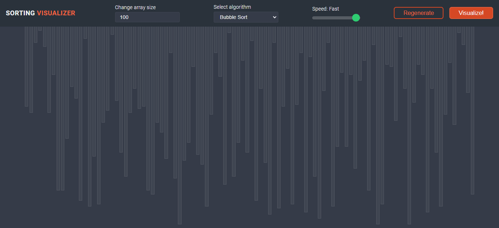

# [Sorting Visualizer](https://0l1v3rr.github.io/sorting-visualizer/)
〽️ A simple web tool to visualize the different sorting algorithms.  
This sorting visualization is not spectacular in mobile, so the webpage is not fully responsive.  
You can find more algorithms with more details [here](https://github.com/0l1v3rr/algorithms)!  
Demo: [click here](https://0l1v3rr.github.io/sorting-visualizer/)

## Available algorithms:
- Bubble Sort
- Selection Sort
- Insertion Sort
- Quick Sort
- Heap Sort

## Features:
- Visualize Sorting algorithm
- Change the size of the array
- Select sorting algorithm
- Change the speed
- Regenerate the array